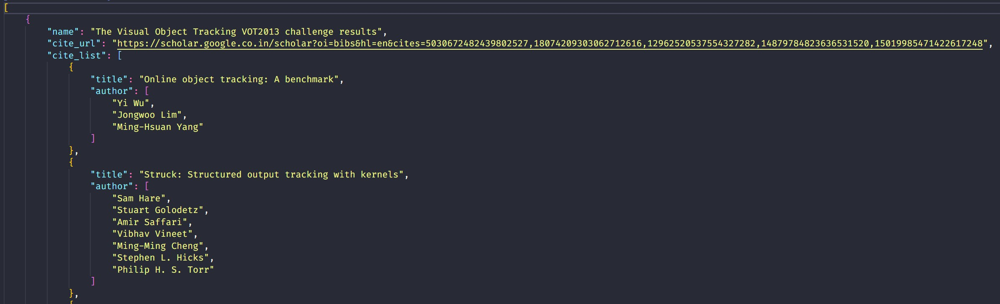
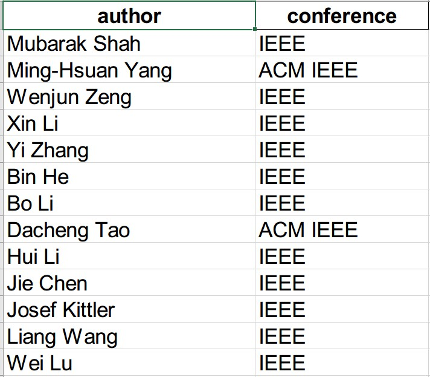
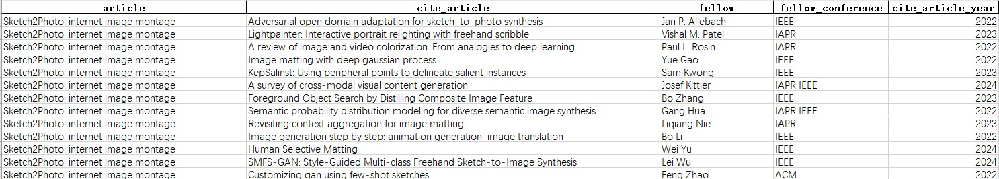

# gs-cite-fellow

This project is used to find all Fellows who have cited the scholar's article.

### Process

1. Crawl the scholar's Google Scholar home page for all articles published by the scholar, and the Google Scholar citation link for each article.
2. Crawl the title of each cited article in the Google Scholar citation link for each article.
3. Clean the titles of the crawled articles.
4. Crawl the author name of each cited article in parallel in DBLP.
5. Merge the parallel crawl results in DBLP.
6. Crawl or get the list of Fellows directly.
7. Clean the Fellow list.
8. Compare the author names of each cited article with the Fellow list and output the final result.

### New Functions and Optimizations

1. **Added random wait time within 2 seconds**: This helps mitigate triggering anti-crawling mechanisms. If the same IP triggers the mechanism frequently, changing the local proxy IP is necessary. Adjusting this time can balance program speed and anti-crawling measures.
2. **Added `citation_threshold` (lower limit) and `citation_limit` (upper limit)**: These can be configured in the configuration file to filter out papers that do not meet citation conditions, making it easier to select relevant papers.
3. **Added missing Fellow lists from recent years**, including IEEE Fellow, ACM Fellow, AAAI Fellow, and IAPR Fellow, all updated to the latest 2024 or 2025 versions.
4. **Enhanced result data with `cite_article_year` field**: This field indicates the citation year of the Fellow's referenced paper, supporting incremental updates based on existing data.
5. **Implemented citation year filtering**: A new configuration option `citation_since_year` has been added. If a citation is from before a specified year, it is automatically skipped, reducing computational overhead and improving efficiency.

### Some Questions

- **Same name**: The cited author and the fellow author may have the same name.
- **Inconsistent correspondence between article and author**: Some articles are not included in DBLP.
- **Incomplete fellow list**.
- **Google Scholar only shows 1000 cited paper results**.

So the results are still relatively inaccurate and need to be checked manually.

## Installation

```
pip install -r requirements.txt
```

## Configuration

Add the following to `config.json`.

- `driver_path`: The path to the Google Chrome driver, which must match the installed Google Chrome version.

## Run the code

1. Configure the environment according to project requirements and download the appropriate version of `chromedriver` for your system. Note the installation path.

2. Set up `config.json` with the following example settings:

   - `scholar_id`: The Google Scholar ID of the scholar being analyzed. Examples:
     - **Cheng Mingming**: huWpVyEAAAAJ
     - **Liu Yun**: UB3doCoAAAAJ
     - **Li Xiang**: oamjJdYAAAAJ
     - **Liu Xialei**: akuWIJQAAAAJ
     - **Dai Yimian**: y5Ov6VAAAAAJ
   - `citation_threshold` and `citation_limit`: Define the citation count range for filtering relevant articles. If you want to check which articles have cited a paper with 4,228 citations, you can set `citation_threshold` to 4000 and `citation_limit` to 4300 to define this range.
   - `citation_since_year`: Specify the earliest citation year to include. If you are only interested in citations after 2022, you can set `citation_since_year` to 2022.

3. Execute the following steps in order:

```bash
# 01  
python 01_article.py
# Generates `articles.json` in the `data` folder containing information on target papers.

# 02 
python 02_citation.py 0
# Opens Google Scholar in browser and crawls citation data starting from the first article.

# 03 
python 03_clear.py
# Cleans and formats the data.

# 04 
python 04_author.py {{parallel_id}} {{parallel_count}}
# Retrieves author information for cited papers. Use parallel processing if needed:
# Example: A runs `python 04_author.py 0 2`, B runs `python 04_author.py 1 2`.
# Without parallel processing: `python 04_author.py 0 1`

# 05
python 05_merge.py {{parallel_count}}
# Merges author information from parallel runs. Ensure that parallel_count remains consistent with #04.
# Without parallel processing: `python 05_merge.py 1`

# 08 
python 08_compare_fellow.py
# Identifies Fellows citing the target papers, generating `result.xls` and `fellow.xls` in `result` folder.
```

4. After completing a run, back up the results to prevent them from being overwritten in future runs.

## Results

- `articles.json`: All articles published by scholars and all cited articles.


* `fellow.xls`: A list of all the Fellows who have cited the scholar's articles.


- `result.xls`: Specific information about scholar articles cited by Fellows.



